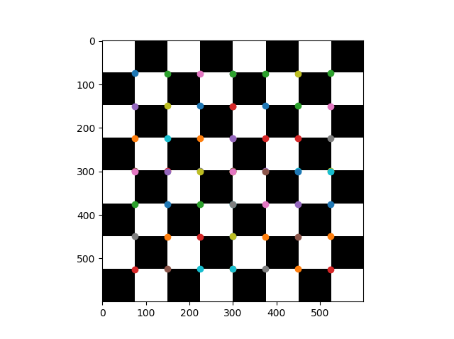
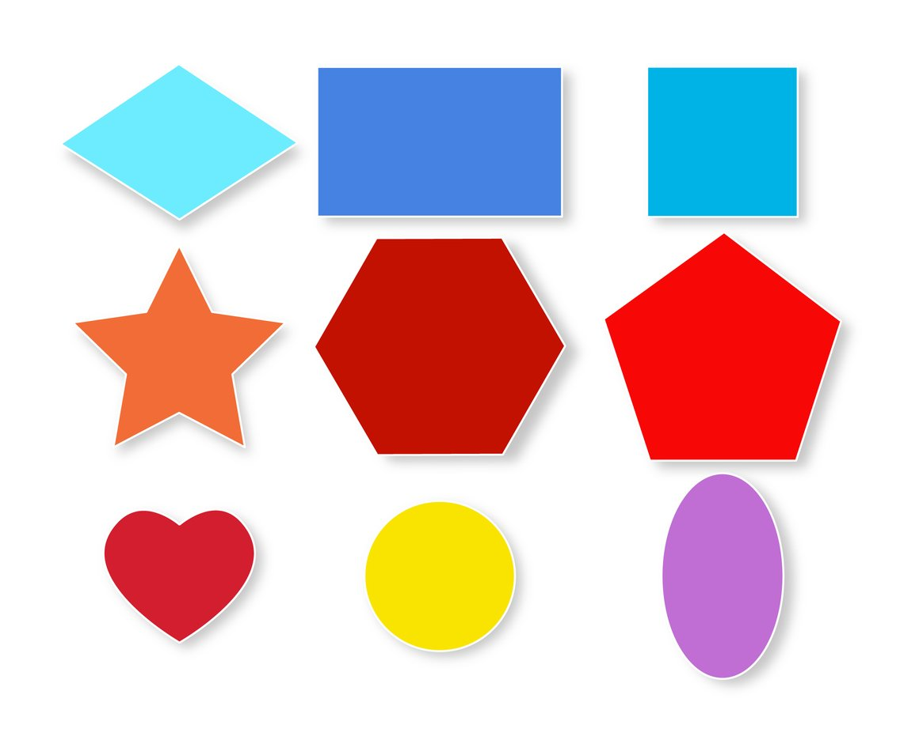
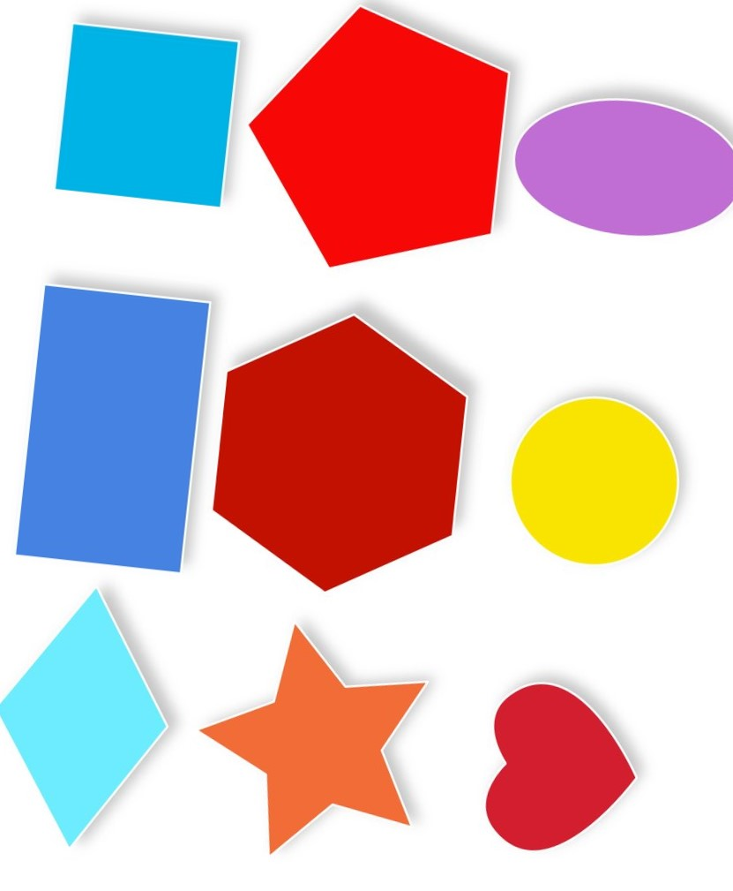
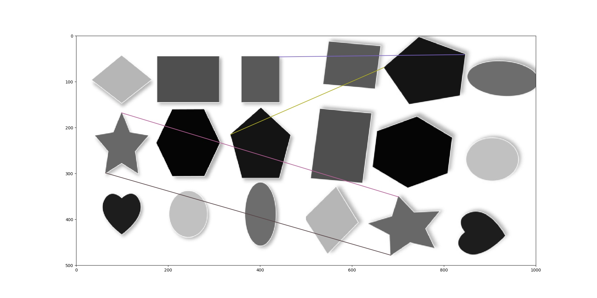

# Task3 <ImageMachingUsingSIFTandHarrisCornerDatection>
## Contributors
| Name | Sec | BN
| -------------- | ----- | -----|
| Mahmoud Khaled Mahmoud | 2 | 19 |  
|amany yasser taha  | 1 |14 |
| Tasneem gamal | 1 | 24|
| Haitham emad  | 2 | 44|
|Mikhail Nady  |2  |33 |
-------------
## code structure 
> **The code is devided into three sections**.
>> **The first section** which Harris corner detection, and it can be found under the file name "Harris_Corner_Detector.py" where we detect all corners in an image, and store those corners coordinates in an array "R" to use it later in SIFT descriptor.
>>> **The second section** which is SIFT descriptor and it can be found under the file name "SIFT_Descriptors.py". It have two funcations the first one is the orientation to get the key points and the second one to get the descriptor.
>>>> **The third section** is the maching function, and it can be found under the name "MachingFuncatin.py", and it contains the fucation to mache the two images even using SSD or correlation methods.
>>>>>**the entery point to the code is the "main" file as we feed two gray scale images to harris corner detection and SIFT descriptor to get the tow deccriptor and the use those descriptor arrays to detectect the similarities between them.**
--------

## Results 
---
### [1] Harris corner detection
####Original image

#### After corner detection

----

### [3] Image Matching 
#### Original image

#### Rotated image

#### Maching Result image

----
### [3] Time computations 
- Execution time of the Harris corner Detector is 14.403521060943604  sec
- Execution time of the feature descriptor generation is 0.09374785423278809  sec
- Execution time of the feature descriptor generation is 0.07878756523132324  sec
- Execution time of SSD matching is 0.000997781753540039  sec

